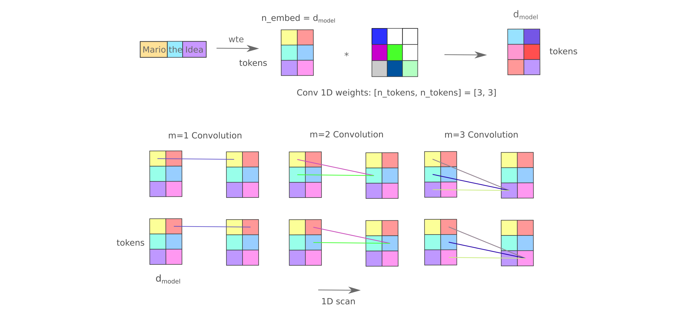

# maskedmixers

Code for the paper 'Masked Mixers for Language Generation and Retrieval', which you can read [here](https://arxiv.org/abs/2409.01482). Datasets and trained models will be added soon.

For a less formal version of this work written as a technical blog post, see [this page](https://blbadger.github.io/smaller-lms.html)

### Brief paper overview:

 Motivated by the poor input representation in transformers and the much better representation in MLP-mixers adapted for causal language modeling (aka masked mixers), we find that these models are approximately as efficient learners of language generation relative to transformers but are far superior for retrieval.

### General Use

Unless you want to replicate a specific experiment, use the `src` directory to train, run, and evaluate mixers and other related models.

### For Experimental Replication

There are two directories for experimental replication purposes: `pc` denotes code used for the 1x Nvidia RTX 3060 node and `server` denotes code used for the 4x V100 node (compatible with DDP).  
